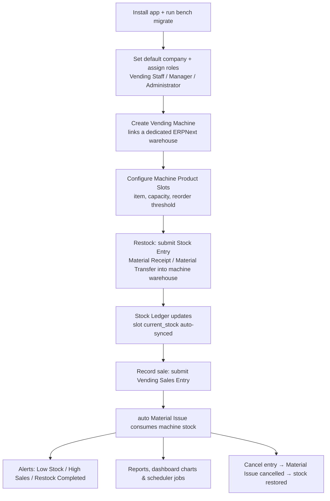

# Vending Tracker

Enterprise vending machine management for **Frappe v15 / ERPNext v15+**.

The application manages and monitors multiple vending machines across multiple
locations while reusing ERPNext's native inventory, warehouse, stock, pricing
and reporting engine — no duplicate stock tables or movement logic.

## Installation

```bash
bench get-app https://github.com/your-org/vending_tracker
bench --site [site_name] install-app vending_tracker
bench --site [site_name] migrate
```

ERPNext v15+ must be installed on the site first (`required_apps = ["erpnext"]`).

## What gets installed

- **Doctypes**: `Vending Machine`, `Machine Product Slot`, `Vending Sales Entry`,
  `Vending Machine Health Log`, `Vending Tracker Settings` (Single).
- **Stock Entry integration**: Custom Fields (`custom_vending_machine`,
  `custom_is_vending_transaction`, `custom_vending_source_document`) + the
  **Vending Restock Workflow** (Draft → Submitted → Cancelled) on `Stock Entry`.
  Restocks are native ERPNext Stock Entries (`Material Transfer` /
  `Material Receipt`) into the machine's dedicated warehouse. All stock movement
  flows through the native Stock Ledger only.
- **Sales**: `Vending Sales Entry` with its own workflow. On submission it
  automatically creates a native `Material Issue` Stock Entry, reducing machine
  stock exclusively through the Stock Ledger.
- **Master data**: Reuses ERPNext `Item`, `Item Group`, `Item Price`, `Warehouse`,
  `Bin`, `Stock Entry`, `Stock Ledger Entry`, `Address`, `Contact`, `Company`,
  `UOM`, `Notification`, `User`, `Role`, `Dashboard`. Only items in the
  **Vending Products** item group are eligible. Item custom fields
  (`Vending Category`, `Default Reorder Threshold`, `Slot Capacity`) are added
  via fixtures.
- **10 reports** (Script + Query), **6 number cards**, **5 dashboard charts**,
  a **Vending Overview workspace**, **8 notifications**, **3 roles**, **2
  workflows**, **4 print formats**, **client & server scripts**.
- **REST APIs** for IoT machine registration, heartbeat, status, sales sync,
  stock sync, product sync and inventory lookup (token authenticated).
- **Scheduler jobs** for low stock detection, dashboard refresh, IoT
  synchronisation, daily reports, revenue summary and machine health checks.

## Workflow: Start to End

### Document workflows

Two Frappe workflows ship with the app, both mirroring the native docstatus
flow **Draft → Submitted → Cancelled**:

**Vending Sales Entry Workflow** — applied to `Vending Sales Entry`

| State | DocStatus | Edit allowed by |
| --- | --- | --- |
| Draft | 0 | Vending Staff |
| Submitted | 1 | Vending Manager |
| Cancelled | 2 | Vending Manager |

| Transition | Action | From → To | Allowed roles |
| --- | --- | --- | --- |
| Submit | Submit | Draft → Submitted | Vending Staff, Vending Manager, Vending Administrator, System Manager |
| Cancel | Cancel | Submitted → Cancelled | Vending Manager, Vending Administrator, System Manager |

**Vending Restock Workflow** — applied to `Stock Entry`

| State | DocStatus | Edit allowed by |
| --- | --- | --- |
| Draft | 0 | Stock User |
| Submitted | 1 | Stock Manager |
| Cancelled | 2 | Stock Manager |

| Transition | Action | From → To | Allowed roles |
| --- | --- | --- | --- |
| Submit | Submit | Draft → Submitted | Vending Manager, Vending Administrator, Stock User, Stock Manager, System Manager |
| Cancel | Cancel | Submitted → Cancelled | Vending Manager, Vending Administrator, Stock Manager, System Manager |

> Because the Restock Workflow applies to the whole `Stock Entry` doctype,
> every Stock Entry on the instance carries a `workflow_state` field and
> workflow action bar. States are set automatically on submit/cancel, and the
> standard ERPNext stock roles are included in the transitions, so regular
> ERPNext users are never locked out (see Notes below for how to opt out).

### Operational flow (start to end)



1. **Install & setup** — install the app (`bench --site [site] install-app
   vending_tracker`) and run `bench migrate`. Assign the **Vending Staff**,
   **Vending Manager** and **Vending Administrator** roles to users. Sample
   data seeds automatically once a default company is set.
2. **Create the machine** — a `Vending Machine` record (id, name, type,
   location, IoT token). With *Auto Create Machine Warehouses* enabled (the
   default) its dedicated warehouse (`VM - <machine_id>`) is created
   automatically; all of that machine's stock lives there.
3. **Configure slots** — one `Machine Product Slot` per product position:
   link the machine and a **Vending Products** item, then set the slot number,
   maximum capacity and reorder threshold. Capacity and threshold are fetched
   from the item's custom fields (`Slot Capacity`, `Default Reorder
   Threshold`) when left blank.
4. **Restock (Draft → Submitted)** — create a `Stock Entry` and submit it:
   `Material Receipt` to fill the machine warehouse, or `Material Transfer` to
   move stock in from a central warehouse. The Stock Ledger moves the stock
   and the slot's `current_stock` / `stock_status` are recomputed
   automatically; the **Restock Completed** notification fires.
5. **Sell (Draft → Submitted)** — submit a `Vending Sales Entry` (machine,
   item, quantity). The rate is taken from the item's Standard Selling price
   list, the amount is computed, and a native `Material Issue` Stock Entry is
   created and submitted automatically to consume the stock from the machine
   warehouse — the Stock Ledger stays the single source of truth.
6. **Alerts** — after a sale, slots at or below their reorder threshold raise
   a **Low Stock** alert (once per cycle), and sales at or above the **High
   Sales Threshold** (Vending Tracker Settings) notify Vending Managers.
   Machine value changes (offline, disabled, API / IoT sync failures) raise
   their own alerts.
7. **Cancel (Submitted → Cancelled)** — cancelling a sales entry cancels the
   generated `Material Issue`, restoring the stock; Stock Entries cancel the
   same way.
8. **Report & monitor** — the **Vending Tracker** workspace, 10 reports,
   6 number cards and 5 dashboard charts surface revenue, machine
   utilisation, low stock and item performance. Scheduler jobs run machine
   health checks and IoT synchronisation hourly, and low-stock detection,
   revenue summaries and daily report emails daily.

## Fixtures & module files

Version-controlled configuration is delivered two ways, both auto-installed on
`migrate`:

- `fixtures/` — Custom Field, Property Setter, Client Script, Server Script,
  Role, Notification, Workflow, Print Format.
- module folders — `doctype/`, `report/`, `workspace/`, `dashboard_chart/`,
  `number_card/`, `templates/`.

Both are auto-installed on `bench migrate` (reports, workspaces, charts and
cards sync as module files; the rest through the fixture import). You can
regenerate fixture snapshots anytime with `bench --site [site] export-fixtures`.

## Dashboard vs Workspace

In Frappe v14+ the legacy `Dashboard` doctype was replaced by **Workspaces**
(ERPNext v15 itself ships no `{module}_dashboard` folders). The requested
"Vending Overview" dashboard is therefore delivered as the **Vending Tracker**
workspace, which contains all the requested blocks: revenue / today's / monthly
revenue number cards, revenue-by-machine and monthly revenue charts, best
selling products (Product Performance chart), stock level trend chart, low
stock alert, restock history and machine status links.

## REST APIs (token-authenticated)

IoT devices authenticate with `machine_id` + `iot_token`:

- `POST /api/method/vending_tracker.api.machine.register` (admin)
- `GET /api/method/vending_tracker.api.machine.heartbeat`
- `GET /api/method/vending_tracker.api.machine.get_status`
- `POST /api/method/vending_tracker.api.sales.sync_sales`
- `POST /api/method/vending_tracker.api.stock.sync_stock`
- `GET /api/method/vending_tracker.api.stock.get_inventory`
- `GET /api/method/vending_tracker.api.products.sync_products`

Server Scripts also expose `GET /api/method/Vending_Machine_Status` and
`GET /api/method/Vending_Low_Stock_Check` (login required).

## Notes

- **Workflow blast radius**: the `Vending Restock Workflow` is intentionally
  applied to `Stock Entry` (per project decision). Because workflows apply to a
  whole doctype, every Stock Entry on the instance gets the `workflow_state`
  field and workflow action bar. Programmatic submission from ERPNext (e.g.
  purchase receipts) is unaffected — workflow states are set automatically on
  submit/cancel — and Stock User / Stock Manager / System Manager are all in
  the transitions, so standard ERPNext users are not locked out. If you prefer
  zero impact on non-vending stock entries, deactivate the workflow and rely
  on the built-in docstatus instead.
- **Install hooks**: install/uninstall logic lives in `install.py` /
  `uninstall.py` (hooks `after_install` / `before_uninstall`), the standard
  Frappe v15 convention.
- **Sample data** (6 products, one machine + slots) is created on install, but
  only when the site has a default company configured (fresh sites usually set
  one via the setup wizard). It is existence-guarded and safe to re-run; delete
  it in production if not needed.
- The `Vending Sales Entry` and `Stock Entry` workflows both mirror the native
  docstatus flow (Draft → Submitted → Cancelled).
